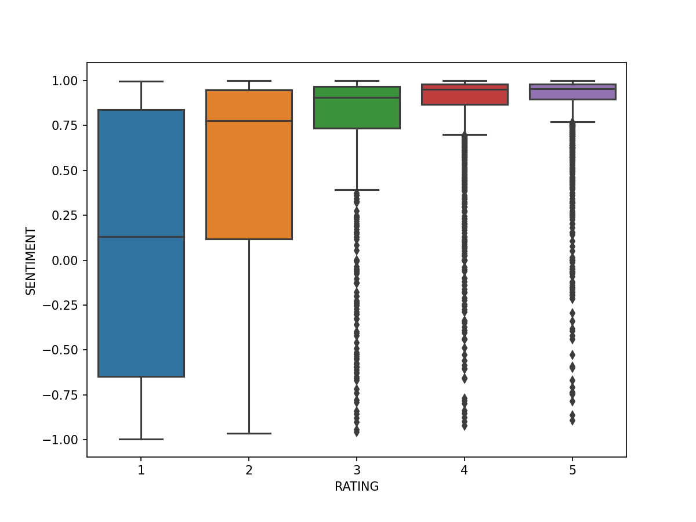

## **MVP**

### Finding the right cup of coffee for you
### Ryan Solava

The goal of this project is to understand the differences between coffee shops,
by analyzing their reviews using NLP tools. The goal is to then build a
recommender system from this data.

Currently the data has been cleaned, tokenized, and vectorized. Also, sentiment
analysis has been performed. The following shows that the review star rating
given by the writer of the review is highly correlated with the sentiment
score of the review.In addition to the average star rating that we had for each
coffee shop, we now have the average sentiment score, which may give a more
nuanced measure of the shops quality. The next step is to do dimensionality
reduction and create topics.

